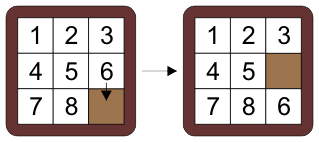
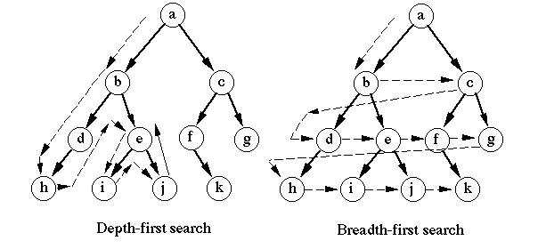

<h1>
In The Name Of ALLAH
</h1>
<h2>
Advanced Programming - Midterm Project
</h2>
<h2>
Dr.Amir Jahanshahi
</h2>
<h3>
Deadline: Thursday, 4 Dey - 23:00

  
# Introduction

Hooman saw a group of people on Arshe, gathering around a smart phone and trying to figure out a puzzle! He got closer and asked what was going on! Hamed said that Hossein and Hesam challenged each other to solve this puzzle under 2 mins for a juice from Electrical Jacob! And it’s been 30 minutes since they keep on saying "It will be done in a minute"!!!

After hearing the story, Hooman saw the puzzle, it seemed so easy to him that he claimed he could solve it faster than them all and then started taking part in that challenge.

It’s been a week since Hooman had to buy a lot of juices for a lot of people but he is not yet successful in solving that easy looking puzzle! 

As Hooman was an AP student last semester, he decided to write a code to solve that puzzle. So here we are, helping him get this project done and avoid financial damage!

# Algorithms

The algorithms to search each state of puzzle are DFS (DLS) and BFS (BLS). (use google and youtube for details of the algorithms!)

# How To Play

The user can choose whether he wants to solve his own 8-puzzle or want to see how a random puzzle is solved. So both states must be provided in the interface of the game.

  1. Generating a random 8-puzzle and present the step by step solution.

  2. Get users puzzle information as input and give the step by step solution.
   
All the steps to solve the puzzle, must be shown in a beautiful manner. Also number of steps must be shown.

# Bonus Points

1.  User might want to get to a special state of the puzzle. So there must be an option to change the goal node.
2.  Implementing the search algorithm with Bidirectional Search method will have extra points.
3.  And of course the more beautiful your UI, the better your grade! (you can use ANSI Codes to have a colorful output!)

# Notes
1.  Each student must create a github repository with his/her name for this project. You must have meaningful **commits** during your progress. These commits would be checked and have direct effect in your grade. For the sake of security :) please don't share your repo with other students!

2. In the end, each student must have a report file in pdf format and a presentation file in powerpoint. We would have a session and some random guys would present their work.
